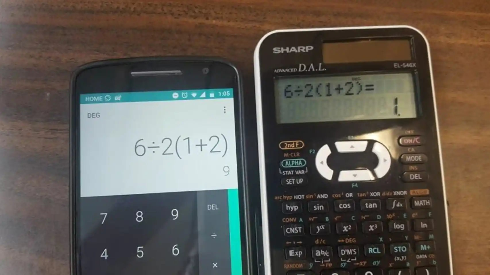

# Ejercicios Resueltos

## Ejercicio 1

El orden de los operadores aritméticos es muy importante ya que dependiendo del orden obtenemos un resultado u otro. En programación, el orden de los operadores es el mismo que el utilizado en matemáticas.



En este reto deberás programar la operación matemática "6 / 2 ( 1 + 2 )" utilizando las instrucciones necesarias.

¿Cuál es el resultado correcto de la operación? ¿1 ó 9?
Explique por que la otra calculadora genera un resultado diferente.

## Ejercicio 2: ¿Ves algún error en el precio?

En el mercado, podemos encontrar que el precio del producto Pernil Iberic D'Engreix Llen. Azuaga en porción de 100 gramos cuesta 5,95€ y el vendedor nos dice que el precio por kilo cuesta 29,75€. ¿Crees que es correcto el precio?

En este reto tienes que hacer un programa que calcule correctamente el precio por kilo del producto.

## Ejercicio 3: ¿Cuántos peces hay en el acuario?

El agua de las granjas de Minnesota, Iowa, Illinois, Wisconsin, Missouri, Tennesse, Arkansas, Misssissipi y Louisiana desemboca en el Océano Atlántico produciendo un fenómeno llamado zona muerta. Debido a los altos niveles de nitrógeno y fósforo que traen estas aguas los peces mueren en grandes cantidades.

Para evitar que mueran cientos y cientos de peces, la ONG Salvemos los peces de colores ha decidido poner en cuarentena a 284 peces rojos y 163 peces azules en un gigantesco acuario, para devolverlos al mar cuando estén curados. ¿Cuántos peces hay en total dentro del acuario?

## Ejercicio 4: ¿Cuánto se ha gastado Carmen?

La posibilidad de ir al cine entre semana pagando un precio reducido es una tradición en las salas de cine españolas, lo que se conoce como El día del espectador. En algunos cines, el día del espectador suele ser los miércoles y las entradas se reducen hasta en un 70%. La única pega es que suele ir mucha más gente...

Para aprovechar el día del espectador, Carmen decide ir al cine con sus amigos y sale de su casa con 23€. Al regresar se da cuenta que le quedan 12.75€ ¿Sabrías programar cuánto se ha gastado?

## Ejercicio 5: ¿Cuánto te ha costado el ordenador?

El videojuego en el ordenador está viviendo una nueva época de oro con un montón de juegos exclusivos. Para comprarte un PC Gamer deberás fijarte principalmente en el procesador, la tarjeta gráfica, la memoria RAM... pero sobre todo en los accesorios como el teclado y ratón.

Estás interesado en comprarte un nuevo PC y en la tienda de tu barrio cuesta 660€ con todos los accesorios incluidos. Sin embargo, el vendedor te descuenta el 10% por pronto pago ¿Cuánto tienes que pagar en total por el ordenador con todos los accesorios?

## Ejercicio 6: ¿Qué precio tenían antes del descuento?

En España, las rebajas de invierno suelen comenzar entre los días 1 y 7 de enero y finalizan a final de marzo. Por otro lado, las rebajas de verano empiezan durante la primera semana del mes de julio y finalizan durante el mes de septiembre.

Para aprovechar la temporada de rebajas he salido de compras. He pagado 34€ por unos pantalones que tenían un descuento del 15%. ¿Qué precio tenían antes de aplicar el descuento?

## Ejercicio 7: Calculadora Básica

Escribe un programa que solicite al usuario dos números y luego realice las operaciones de suma, resta, multiplicación y división con esos números. Muestra los resultados en la consola.

## Ejercicio 8: Área y Perímetro de un Rectángulo

Crea un programa que calcule el área y el perímetro de un rectángulo. Solicita al usuario la longitud y el ancho del rectángulo.

## Ejercicio 9: Conversión de Temperaturas

Escribe un programa que convierta una temperatura dada en grados Celsius a grados Fahrenheit y Kelvin. Usa las siguientes fórmulas:

```
Fahrenheit = Celsius * 9/5 + 32
Kelvin = Celsius + 273.15
```

## Ejercicio 10: Media Aritmética

Crea un programa que calcule la media aritmética de tres números introducidos por el usuario.
